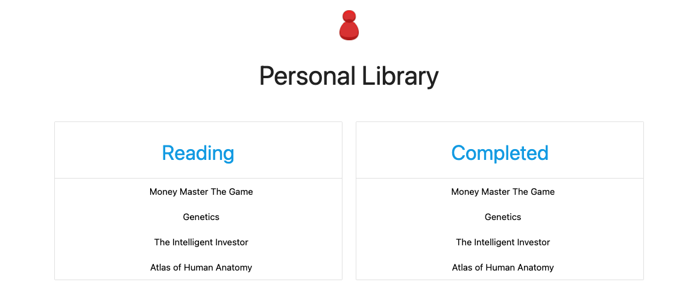

# MVP Library
Developers: Ferdinand Aguwa, Madison Calvo, Miguel Maldonado, Mario Hernandez, Nathaniel Scott

## Table of Contents

* User Story
* Technologies
* Screenshot
* Usage
* Database
* License

# User Story: 

Given the user wants to access their personal library, the user can have a personal authentication to load their current reads, add any books from the shared library, and remove books from their personal list once they have read it to completion.

# Technologies:

Materialize, Bootstrap, JQuery, Sequelize, Passport

## Screenshot

  

  

# Database:

Two tables:
	Users and MVP_Library.
User table is going to track user information such as Name, Read List, password, index, Personal Library.
MVP_Library is going to be a list of books that’s available for all users to Check out a book from. 
Each user will be able to check out a book, and it will ideally show who has that book checked out and for how long (minutes, then hours, then days). 

## License

© 2020 Copyright
